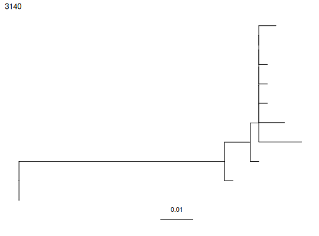

**getTrees** - *Estimate lineage tree topologies, branch lengths,
and internal node states if desired*

Description
--------------------

`getTrees` Tree building function.


Usage
--------------------
```
getTrees(
clones,
trait = NULL,
id = NULL,
dir = NULL,
modelfile = NULL,
build = "pratchet",
exec = NULL,
igphyml = NULL,
fixtrees = FALSE,
nproc = 1,
quiet = 0,
rm_temp = TRUE,
palette = NULL,
seq = NULL,
collapse = FALSE,
...
)
```

Arguments
-------------------

clones
:   a tibble of `airrClone` objects, the output of
[formatClones](formatClones.md)

trait
:   trait to use for parsimony models (required if
`igphyml` specified)

id
:   unique identifer for this analysis (required if
`igphyml` or `dnapars` specified)

dir
:   directory where temporary files will be placed.

modelfile
:   file specifying parsimony model to use

build
:   program to use for tree building (pratchet, pml,
dnapars, dnaml, igphyml)

exec
:   location of desired phylogenetic executable

igphyml
:   optional location of igphyml executible for parsimony

fixtrees
:   if TRUE, use supplied tree topologies

nproc
:   number of cores to parallelize computations

quiet
:   amount of rubbish to print to console

rm_temp
:   remove temporary files (default=TRUE)

palette
:   a named vector specifying colors for each state

seq
:   column name containing sequence information

collapse
:   Collapse internal nodes with identical sequences?

...
:   Additional arguments passed to tree building programs


Value
-------------------

A list of `phylo` objects in the same order as `data`.


Details
-------------------

Estimates phylogenetic tree topologies and branch lengths for a list of
`airrClone` objects. By default, it will use phangnorn::pratchet to
estimate maximum parsimony tree topologies, and ape::acctran to estimate
branch lengths. If `igpyhml` is specified, internal node `trait`
values will be predicted by maximum parsimony. In this case, `dir` will
need to be specified as a temporary directory to place all the intermediate
files (will be created if not available). Further, `id` will need to
specified to serve as a unique identifier for the temporary files. This
should be chosen to ensure that multiple `getTrees` calls using the same
`dir` do not overwrite each others files.

`modelfile` is written automatically if not specified, but doesn't
include any constraints. Intermediate files are deleted by default. This can
be toggled using (`rm_files`).

For examples and vignettes, see https://dowser.readthedocs.io


Examples
-------------------

```R
data(ExampleClones)

trees <- getTrees(ExampleClones[10,])
plotTrees(trees)[[1]]

```



```R

### Not run:
data(ExampleClones)
# 
# trees <- getTrees(ExampleClones[10,],igphyml="/path/to/igphyml",
# id="temp",dir="temp", trait="sample_id")
# plotTrees(trees)[[1]]
```


See also
-------------------

[formatClones](formatClones.md), [findSwitches](findSwitches.md), [buildPhylo](buildPhylo.md),
[buildPratchet](buildPratchet.md), [buildPML](buildPML.md), [buildIgphyml](buildIgphyml.md)


