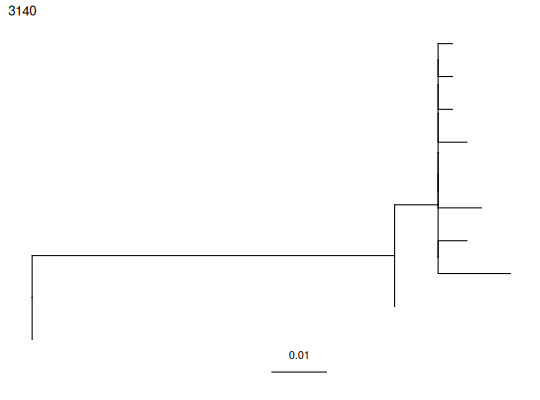

**plotTrees** - *Plot a tree with colored internal node labels using ggtree*

Description
--------------------

`plotTrees` plots a tree or group of trees


Usage
--------------------
```
plotTrees(
trees,
nodes = FALSE,
tips = NULL,
tipsize = NULL,
scale = 0.01,
palette = "Dark2",
base = FALSE,
layout = "rectangular",
node_nums = FALSE,
tip_nums = FALSE,
title = TRUE,
labelsize = NULL,
common_scale = FALSE,
ambig = "grey",
bootstrap_scores = FALSE,
tip_palette = NULL,
node_palette = NULL,
guide_title = NULL
)
```

Arguments
-------------------

trees
:   A tibble containing `phylo` and `airrClone`
objects

nodes
:   color internal nodes if possible?

tips
:   color tips if possible?

tipsize
:   size of tip shape objects

scale
:   width of branch length scale bar

palette
:   color palette for tips and/or nodes. Can supply a named vector
for all tip states, or a palette named passed to
ggplot2::scale_color_brewer (e.g. "Dark2", "Paired", "Set1") or
ggplot2::scale_color_distiller (e.g. RdYlBu) or

base
:   recursion base case (don't edit)

layout
:   rectangular or circular tree layout?

node_nums
:   plot internal node numbers?

tip_nums
:   plot tip numbers?

title
:   use clone id as title?

labelsize
:   text size

common_scale
:   stretch plots so branches are on same scale?
determined by sequence with highest divergence

ambig
:   How to color ambiguous node reconstructions? (grey or blend)

bootstrap_scores
:   Show bootstrap scores for internal nodes? See getBootstraps.

tip_palette
:   deprecated, use palette

node_palette
:   deprecated, use palette

guide_title
:   Title of color guide. Defaults to tips variable if specified.


Value
-------------------

a grob containing a tree plotted by `ggtree`.


Details
-------------------

Function uses `ggtree` functions to plot tree topologies estimated by 
[getTrees](getTrees.md), and [findSwitches](findSwitches.md). Object can be further modified with 
`ggtree` functions. Please check out 
https://bioconductor.org/packages/devel/bioc/vignettes/ggtree/inst/doc/ggtree.html and
cite `ggtree` in addition to `dowser` if you use this function.


Examples
-------------------

```R
data(ExampleClones)
trees <- getTrees(ExampleClones[10,])
plotTrees(trees)[[1]]
```




See also
-------------------

[getTrees](getTrees.md), [findSwitches](findSwitches.md)


