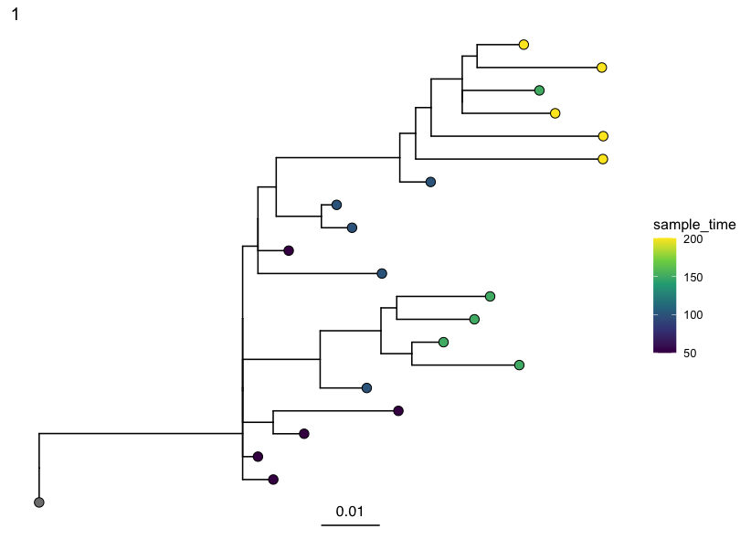
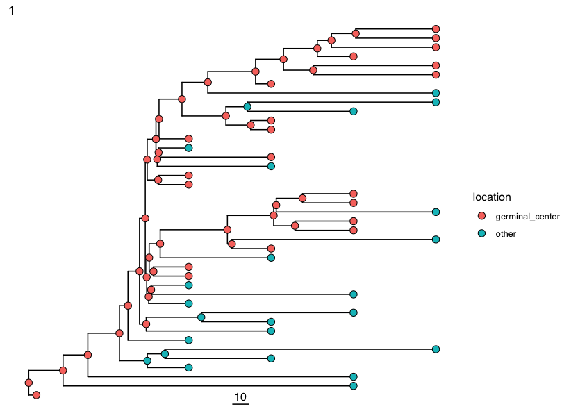

# Build Time Trees Using TyCHE and BEAST

## Building Time Trees
<div class="admonition-announcement attention">
  <p class="admonition-title">Expected tutorial time</p>
      This tutorial takes approximately an hour to complete, including 45 minutes of BEAST2 run time. You can reduce the run time by following the suggestions in the tip boxes above each code chunk that runs BEAST2.
      <br><br>
</div>

There are many options for building time trees using BEAST2. Here we demonstrate
how to use TyCHE to fit a type-linked clock for heterogeneous evolution to
B-cell data. 

Inferring time-resolved phylogenies requires a clock model, which describes the 
relationship between evolution and time within the population. A “strict clock” 
model assumes a constant rate of evolution over time. Other models allow clock 
rates to vary, such as the uncorrelated lognormal distribution relaxed clock.

Inferring time trees for cell populations using natural mutations is challenging 
because cellular evolution is highly heterogenous. For example, B cells undergo 
periods of rapid somatic hypermutation in germinal centers during immune 
responses before becoming quiescent memory cells.

In contrast to other methods, TyCHE simultaneously reconstructs ancestral trait 
states and dates of tree nodes using type-specific clock rates. 

## Requirements

This tutorial requires Dowser 2.4 or later.

You will also need to have BEAST2, TyCHE and rootfreqs installed on your machine.


#### For Mac and Windows machines, we recommend:
<style>
  .rst-content .section ul.os {
    list-style: none;
    list-style-type: none;
  }
  .rst-content .section .os li {
    list-style: none;
    list-style-type: none;
    position: relative;
    left: 6em;
  }
  .os li:before{
    position: absolute;
    left: -6em;
    width: 3.5em;
    text-align: left;
  }
  li.mac:before {
    content: "Mac:";
    font-weight: bold;
  }
  li.windows:before {
    content: "Windows:";
    font-weight: bold;
  }
</style>
<ol>
 <li>
    <ul class="os">
     <br/>
     <li class="mac">Click to <a href="https://github.com/CompEvol/beast2/releases/download/v2.7.7/BEAST.v2.7.7.Mac.dmg">download the BEAST 2.7.7 dmg</a> </li>
     <li class="windows">Click to <a href="https://github.com/CompEvol/beast2/releases/download/v2.7.7/BEAST.v2.7.7.Windows.zip">download the BEAST 2.7.7 zip</a></li>
    </ul>
   <b>OR</b> download the appropriate version from <a href="https://github.com/CompEvol/beast2/releases/tag/v2.7.7">https://github.com/CompEvol/beast2/releases/tag/v2.7.7</a>
or <a href="https://www.beast2.org">www.beast2.org</a>.
  </li>
  <br/>
 <li>
 <ul class="os">
     <li><br/></li>
     <li class="mac">Open the dmg file and drag the BEAST application to your Applications folder</li>
     <li class="windows">Right click on the zip file to extract the BEAST folder</li>
    </ul>
 </li>
</ol>
3. Open BEAUti, click on the "File" menu, and select "Manage Packages...".

4. In the package manager, find and install the "BEAST Classic" package.

5. Follow this tutorial to install the [TyCHE package](https://github.com/hoehnlab/tyche) "by hand":
[www.beast2.org/managing-packages](https://www.beast2.org/managing-packages/index.html)

6. Follow this tutorial to install the [rootfreqs package](https://github.com/rbouckaert/rootfreqs) "by hand":
[www.beast2.org/managing-packages](https://www.beast2.org/managing-packages/index.html)

#### For Linux machines, we recommend running:

``` bash
# Choose appropriate version for your architecture (x86 or aarch64)
BEAST=BEAST.v2.7.7.Linux.x86.tgz # or BEAST=BEAST.v2.7.7.Linux.aarch64.tgz

# download file and uncompress
curl -O https://github.com/CompEvol/beast2/releases/download/v2.7.7/$BEAST
tar -xvzf $BEAST

# optionally remove the compressed file
rm $BEAST

# run BEAST, at least with help, to allow it to set up its directories
~/beast/bin/beast -help

# install BEAST Classic package
~/beast/bin/packagemanager -add BEAST_CLASSIC

# install TyCHE package (currently not released on BEAST package manager)
curl -O https://github.com/hoehnlab/tyche/releases/download/v0.0.3/TyCHE.v0.0.3.zip 
unzip -o -d ~/.beast/2.7/TyCHE TyCHE.v0.0.3.zip
rm -f TyCHE.v0.0.3.zip

# install rootfreqs package
ROOTFREQS=rootfreqs.package.v0.0.2.zip
curl -O https://github.com/rbouckaert/rootfreqs/releases/download/v0.0.2/$ROOTFREQS
unzip -o -d ~/.beast/2.7/rootfreqs $ROOTFREQS
rm -f $ROOTFREQS

```


### Download and set up XML templates

BEAST models are specified and run through XML files. A template is required to run BEAST2 through Dowser.

We provide several BEAST XML templates in the 
[xml-templates repository](https://github.com/hoehnlab/xml-templates/). You can 
download these and modify them as needed. Additionally, you can create your own
XML templates for custom analyses.

The templates used in this tutorial are:

- `custom/StrictClock_Standard_EmpFreq.xml`: A simple strict clock model with empirical nucleotide frequencies.
- `custom/TraitLinkedExpectedOccupancy_EstTraitClockRates_EmpFreq.xml`: A trait-linked clock model using an expected occupancy method for determining the proportion of each branch in each state, estimating separate clock rates for each state, and using empirical nucleotide frequencies.

You can specify the path to the
template in the `template` argument of `getTimeTreesIterate`, or you can pass a 
connection object to the `template` argument, e.g. 
`getTimeTreesIterate(..., template = url(<url-to-github-file-raw>), ...)`. In this 
tutorial, we assume you have downloaded the above templates to your working directory.

---

## Setting up data

This step proceeds as in tree building, but it is important to specify the column 
of the trait you want to analyze in the `formatClones` step. In this example we are 
using simulated data from germinal center and "other" tissue. However, this could 
be any discrete trait value such as cell types. 


``` r
library(dowser)
library(dplyr)
library(ggtree)

# load example AIRR tsv data
data(ExampleAirrTyCHE)

# set up time/date trait
ExampleAirrTyCHE$sample_time <- as.numeric(ExampleAirrTyCHE$sample_time)

# trait value of interest
trait="location"

clones <- formatClones(
  ExampleAirrTyCHE,
  traits = c(trait, "sample_time"),
  germ   = "germline_alignment"
)

# Column shows which location the B cell was obtained from
print(table(ExampleAirrTyCHE[[trait]]))
```


```
## Error in eval(expr, envir, enclos): object 'ExampleAirrTyCHE' not found
```
---

## Estimating the GC clock rate

The type-linked clock models implemented in TyCHE link each trait to a separate 
molecular clock rate which can be either fixed or estimated as a parameter. The
models perform best when there is prior information about the rate of one 
or both populations. 

If you do not have an external estimate of the clock rate for each trait, you can estimate
the clock rate using a using root-to-tip regression or by fitting a strict clock 
model to GC B cells. 

Here we estimate the clock rate of germinal center B cells using BEAST2 with a strict clock model.

``` r
gc_cells = filter(ExampleAirrTyCHE, location=="germinal_center")
gcf = formatClones(gc_cells, traits=c("location","sample_time"),
	germ="germline_alignment")


gctrees = getTrees(gcf, build="pml", sub_model="HKY")

plotTrees(gctrees)[[1]] + geom_tippoint(aes(color=sample_time))
```
 


<div class="admonition-announcement tip">
  <p class="admonition-title">Tip</p>
  With two processors available, the next step takes about 15 minutes to run, depending on your machine. 
  For a quick demonstration set smaller `mcmc_length` or `iterations`, but expect
  results to be unconverged.
      <br><br>
</div>

`getTimeTreesIterate` will run BEAST2 on each clone in parallel 
(here, `nproc=2`, so 2 clones at a time).


``` r
# edit to your BEAST installation path
beast <- "/Applications/BEAST 2.7.7/bin/"

# estimate clock rate of GC B cells
# if you don't care about convergence, reduce mcmc_length
# ensure you are providing the correct path to the template file downloaded earlier (see Requirements)
gctree = getTimeTreesIterate(gcf,
	beast=beast,
	template="StrictClock_Standard_EmpFreq.xml",
	dir="temp",
	id="gc_strict",
	time="sample_time",
	mcmc_length=1e6,
	iterations=10,
	nproc=2, 
	CLOCK_RATE_INIT=0.001,
	KAPPA_PRIOR_M=0.67,
	KAPPA_PRIOR_S=0.2,
	ignore=c("freqParameter"))


gcrate_tree = mean(sapply(gctree$parameters, function(x)filter(x,item=="geneticClockRate")$mean))
print(gcrate_tree)
```

```
## [1] 0.000363
```

If it is not feasible to run a strict clock analysis, you can use the slope from a
root-to-tip regression. Here, we estimate the clock rate of germinal center B cells
using a root-to-tip regression.


``` r
gcrate_slope = mean(correlationTest(gctrees, time="sample_time")$slope)
print(gcrate_slope)
```


```
## [1] 0.0003686277
```
---


## Run getTimeTreesIterate with a TyCHE template

We can now run a trait-linked TyCHE model using the estimated GC rate. Here, we 
use the *TraitLinkedExpectedOccupancy* model, which uses an expected 
occupancy method to determine the proportion of each branch in each state. 

Features of this template:

- Allows estimation of clock rates:
  - we provide values of the mean (`TRAIT_RATE_MEAN_1`, `TRAIT_RATE_MEAN_2`) 
and sigma (`TRAIT_RATE_SIGMA_1`, `TRAIT_RATE_SIGMA_2`)
for the prior normal distributions of each clock rate.
- Uses empirical nucleotide frequencies as the equilibrium frequencies.
  - Dowser will automatically calculate these frequencies from the input sequences.
  - Recommended for most data, especially BCRs.

`getTimeTreesIterate` is designed to run each analysis iteratively, checking for
convergence after each iteration. If the analyses converge before 
reaching the max iterations, it will stop early. It will run each analysis for `mcmc_length`
MCMC samples (here, `1e6`), and it will repeat this up to `iterations` times (here, `20`), 
so here we have a maximum of 2e7 MCMC samples. 

The convergence check is based 
on the ESS of the parameters reported in the log files. You can exclude parameters
from this ESS check using the `ignore` argument (here, we ignore `freqParameter`, as it
is a fixed value).

<div class="admonition-announcement tip">
  <p class="admonition-title">Tip</p>
      This step takes about 30 minutes to run, depending on your machine. 
      For a quick demonstration set smaller `mcmc_length` or `iterations`, but expect
      results to be unconverged.
      <br><br>
</div>


``` r
mixed_trees <- getTimeTreesIterate(
  clones,
  beast    = beast,
  template = "TraitLinkedExpectedOccupancy_EstTraitClockRates_EmpFreq.xml",
  trait    = trait,
  time     = "sample_time",
  dir      = "temp",
  id       = "tyche_eo_est",
  log_every = "auto",
  nproc     = 2,
  KAPPA_PRIOR_M = 0.67,
  KAPPA_PRIOR_S = 0.2,
  TRAIT_RATE_MEAN_1 = gcrate_tree,
  TRAIT_RATE_MEAN_2 = 0.000001,
  TRAIT_RATE_SIGMA_1 = gcrate_tree * 0.01,
  TRAIT_RATE_SIGMA_2 = 0.001,
  RATE_INDICATORS = "1 0",
  TRANSITION_RATE_ALPHA_1 = 0.1,
  TRANSITION_RATE_ALPHA_2 = 1.0,
  TRANSITION_RATE_BETA_1  = 0.1,
  TRANSITION_RATE_BETA_2  = 1.0,
  log_target   = 2000,
  mcmc_length  = 1e6,
  ignore       = c("freqParameter"),
  iterations   = 20
)
```

`getTimeTreesIterate` will run BEAST2 on each clone in parallel 
(here, `nproc=2`, so 2 at a time).

To capture sufficient information about the posterior distribution while keeping 
log files from becoming overly large or unwieldy, we provide the option to set 
`log_every="auto"`. This will automatically set the logging frequency based on 
the `mcmc_length` and `log_target` (here, `2000`, so we aim to have around 2000 
samples in the log file). You can also set a fixed logging frequency by providing 
an integer value.

The rate indicators (`RATE_INDICATORS`) specify which traits can transition to each
other. In a primary immune response we recommend setting this to `"1 0"`, as GC 
B cells can transition to other tissues, but not vice versa. If your data comprises
chronic infections or repeated vaccinations, you may want to allow transitions in both
directions, so you would set this to `"1 1"`. Note: traits are always sorted ASCII alphabetically.

You can also specify alpha (shape) and beta (rate) values for the prior gamma distributions of the
transition rates between traits. We recommend setting the same prior for each transition
rate except in rare cases.

The prior distribution on kappa is used by the nucleotide substitution model, and we
recommend these values for BCR analyses.

See `?getTimeTreesIterate` and TyCHE and BEAST2 documentation for more details.

---

## Visualize the results
After the analyses have converged, you can visualize the time trees.

Note: plotTrees sets a default value for the scale bar of 0.01, which is appropriate 
for trees with genetic distance branch lengths (mutations per site), but time trees typically 
require a larger scale bar. In this case, we know the data spans 200 time units,
so we set `scale=10` to make the scale bar more visually interpretable.


``` r
plotTrees(mixed_trees, scale=10)[[1]] + geom_point(aes(fill=location), pch=21, size=3)
```


The `parameters` column of `mixed_trees` contains a table that collates the output from the BEAST2 analysis. Columns include the parameter (item), the posterior mean, standard error, standard deviation, median, 95% highest posterior density interval, autocorrelation time (ACT), effective sample size, and geometric mean.

The effective sample size (ESS) of a parameter is a measure of how much independent information your MCMC sample contains. Even though MCMC generates many samples, they are typically autocorrelated—each sample depends on the previous one. ESS is the number of independent draws from the target distribution with the same estimation power and can be thought of as the sample size for that parameter.

A higher ESS means your sample more reliably represents the posterior distribution. Low ESS indicates that you need more information, which can indicate the need for longer MCMC runs. We typically recommend an ESS of at least 200 for each estimated parameter.

The autocorrelation time (ACT) of a parameter measures how strongly each sample in the MCMC chain depends on previous samples. The ACT tells you how long the MCMC chain takes to produce a roughly independent sample. ACT is inversely related to ESS.

If we're interested in the estimated tree height, we can filter the parameters table for `TreeHeight`:


``` r
print(mixed_trees$parameters[[2]] %>% filter(item=="TreeHeight"))
```


```
##         item     mean   stderr   stddev   median X95.HPDlo X95.HPDup      ACT      ESS geometric.mean
## 1 TreeHeight 236.0621 1.595335 19.36631 234.2536  201.9269  275.1676 122150.1 147.3636       235.2881
```

Our model likely hasn't converged, with multiple parameters having ESS values below 200, particularly the posterior which describes how well the model has converged as a whole. The mean tree height is around 236 time units, with a 95% highest posterior density interval from about 200 to 275 time units. Since we know the data spans 200 time units, this is a high estimate, but this is unsurprising given that the ESS is below 200 and the analysis has likely not converged.

The parameters available will depend on the model you used and what is specified for
logging in the XML template. In this case, we can see all the items that were logged:


``` r
print(mixed_trees$parameters[[2]]$item)
```

```
##  [1] "posterior"                      "likelihood"                    
##  [3] "prior"                          "treeLikelihood.tyche_eo_est_2" 
##  [5] "TreeHeight"                     "rateIndicator.type.1"          
##  [7] "rateIndicator.type.2"           "relativeGeoRates.type.1"       
##  [9] "relativeGeoRates.type.2"        "typeSwitchClockRate"           
## [11] "kappa.tyche_eo_est_2"           "BayesianSkyline"               
## [13] "bPopSizes.1"                    "bPopSizes.2"                   
## [15] "bPopSizes.3"                    "bPopSizes.4"                   
## [17] "bPopSizes.5"                    "bGroupSizes.1"                 
## [19] "bGroupSizes.2"                  "bGroupSizes.3"                 
## [21] "bGroupSizes.4"                  "bGroupSizes.5"                 
## [23] "freqParameter.tyche_eo_est_2.1" "freqParameter.tyche_eo_est_2.2"
## [25] "freqParameter.tyche_eo_est_2.3" "freqParameter.tyche_eo_est_2.4"
## [27] "traitfrequencies.type.1"        "traitfrequencies.type.2"       
## [29] "typeLinkedRates.1"              "typeLinkedRates.2"
```

These include the posterior, likelihood, and prior probabilities of the full model; the tree likelihood; estimated values of the tree height, the clock rates for each trait (`typeLinkedRates`), the relative transition rates between traits (`relativeGeoRates`), the rate of switching traits (`typeSwitchClockRate`); parameters relating to BayesianSkyline (`BayesianSkyline`, `bPopSizes`, `bGroupSizes`); and some fixed parameters that are included in logging for record-keeping convenience (the kappa value of the HKY substitution model, the empirical frequencies of the nucleotides, the frequencies of the traits).

If you want to revisit an analysis and no longer have the `mixed_trees` object 
in your R environment, you can use `readBEAST` to read in the BEAST log and tree 
files from the directory (`dir`) you specified in `getTimeTreesIterate`. Because of this,
it is important to always specify a unique combination of `dir` and `id` for each analysis.


``` r
mixed_trees <- readBEAST(clones, dir="temp", id="tyche_eo_est", beast=beast, trait=trait)
```

See `?readBEAST` for more details.

<div class="admonition-announcement tip">
  <p class="admonition-title">Tip</p>
  You can find all of BEAST's output files, including the trees, logs, console logs, and TreeAnnotator outputs, in the `dir` you specified (here, "temp"). You can view these files using BEAST tools such as Tracer.
      <br><br>
</div>


