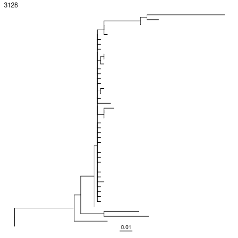
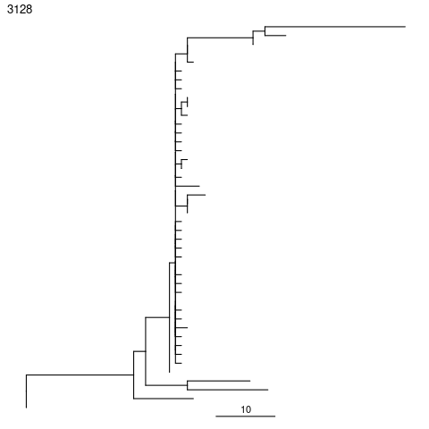
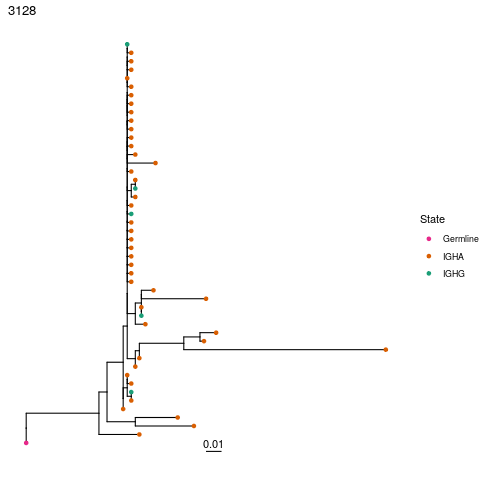
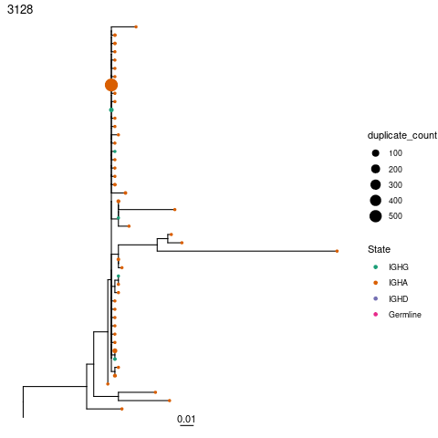
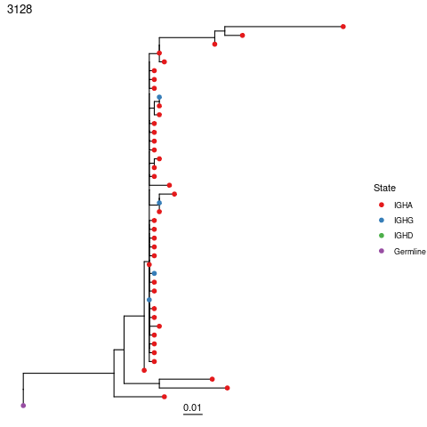
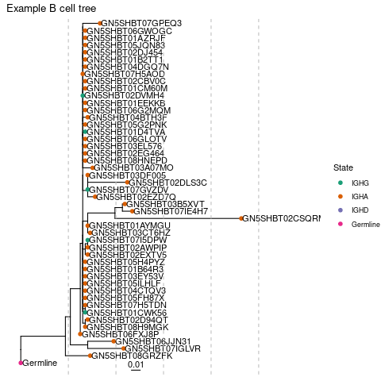

# Plotting trees

Once trees have been built, they can be visualized in multiple ways. The easiest is through the `ggtree` R package. Dowser implements the `plotTrees` function, which makes plotting multiple trees using `ggtree` easier.

First, build trees:

```r

library(dowser)
library(ggtree)
library(ggplot2)
library(dplyr)

data(ExampleDb)

clones = formatClones(ExampleDb, traits=c("c_call"),
    num_fields=c("duplicate_count"), columns=c("d_call"),
    minseq=10)

# build maximum parsimony trees
clones = getTrees(clones)
```

## Basic plotting

The `plotTrees` function will return a list of tree plots in the same order as in the input tibble.

```r
plots = plotTrees(clones)

#Plot the largest tree
#To plot second largest tree, use plots[[2]], and so on
plots[[1]]
```



Default options for `plotTrees` will only plot tree topology and branch lengths. The `clone_id` is by default plotted on the upper lefthand corner. Branch lengths by default represent the number of mutations per site between each node in the tree. These are shown by the scalebar below the tree.


To plot the expected number of mutations between nodes (calculated by multiplying the branch length by the number of sites), use the `scaleBranches` function. The width of the scalebar can be set with the `scale` option. 
```r

# Re-scale branches to represent mutations between nodes
clones_mutations = scaleBranches(clones, edge_type="mutations")

# Plot, set scale bar to represent 10 mutations
plots = plotTrees(clones_mutations, scale=10)

#Plot the largest tree
plots[[1]]
```



## Plotting tip metadata

Metadata associated with each tip in the tree can be plotted by specifying the `tips` and `tipsize` options in the `plotTrees` function. Note however, that you can only specify metadata fields that are specified in the `formatClones` function using either the `traits`, `text_fields`, `num_fields`, or `seq_fields` options.

```r
# Plot tree with sequence isotype at the tips.
plots = plotTrees(clones, tips="c_call")

#Plot the largest tree
plots[[1]]
```



Tip sizes can be manually set to a constant value e.g. `tipsize=2` or set to a data column. For instance, we can scale the tip sizes by the duplicate count of each sequence:

```r
# Plot tree with sequence isotype at the tips, with sizes set to number of duplicates
plots = plotTrees(clones, tips="c_call", tipsize="duplicate_count")

#Plot the largest tree
plots[[1]]
```


The `tip_palette` is constant among all trees plotted at once, and can be specified as either a named vector of hex colors, or as an RColorBrewer palette name:

```r
# These calls create the same plot:

# Plot tree with sequence isotype at the tips, with palette "Set1"
plots = plotTrees(clones, tips="c_call", tipsize=2,
    tip_palette="Set1")

# or, specify a named palette vector
custom_palette=c("IGHA"="#E41A1C", "IGHG"="#377EB8",
    "IGHD"="#4DAF4A", "Germline"="#984EA3")

plots = plotTrees(clones, tips="c_call", tipsize=2,
    tip_palette=custom_palette)

# or, use the getPalette function to create a named palette vector
custom_palette=getPalette(c("IGHA", "IGHG", "IGHD", "Germline"), "Set1")

plots = plotTrees(clones, tips="c_call", tipsize=2,
    tip_palette=custom_palette)

#Plot the largest tree
plots[[1]]
```



## Using ggtree and ggplot functions

The objects returned by `plotTrees` are`ggtree` and `ggplot` objects, and can be manipulated as such. For instance, we can add tip labels using the `geom_tiplab` function from `ggtree`, add vertical lines using the `geom_vline` function from `ggplot`, and edit the title using `ggtitle`. `xlim` can be used to add enough space to the plot for the sequence IDs.

```r
plots = plotTrees(clones, tips="c_call", tipsize=2)

#Plot the largest tree
treeplot = plots[[1]] + geom_tiplab() + 
    geom_vline(xintercept=c(0.05,0.1,0.15,0.2,0.25),
        linetype="dashed",color="grey") + xlim(0,0.3) +
    ggtitle("Example B cell tree")

treeplot
```




## Saving trees to a file

The `treesToPDF` function can be used to plot all trees at once to a pdf file:

```r
plots = plotTrees(clones, tips="c_call", tipsize=2)

# pass any arguments you would pass to grDevices::pdf
treesToPDF(plots, file="trees.pdf", nrow=2, ncol=2)
```