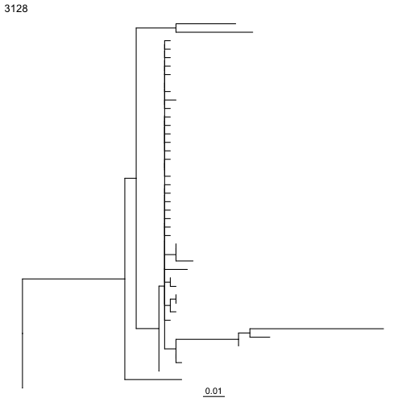
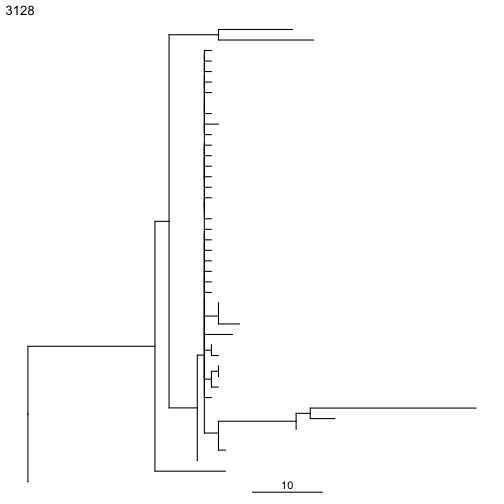
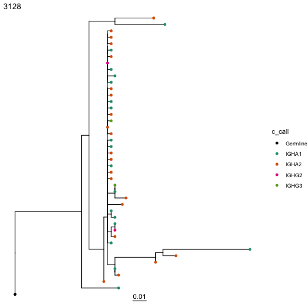
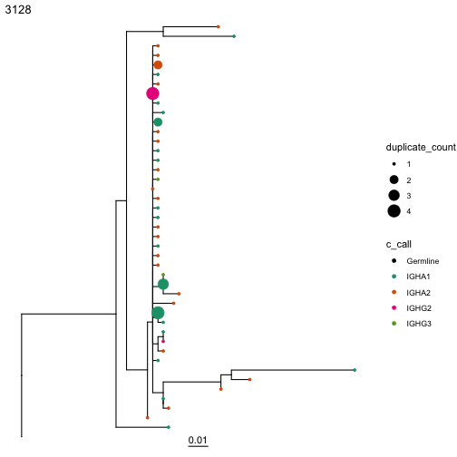
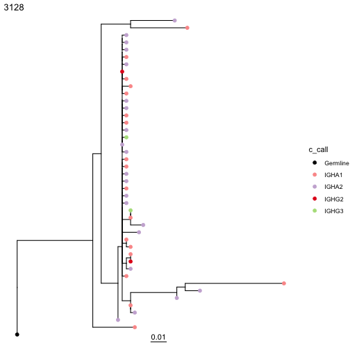
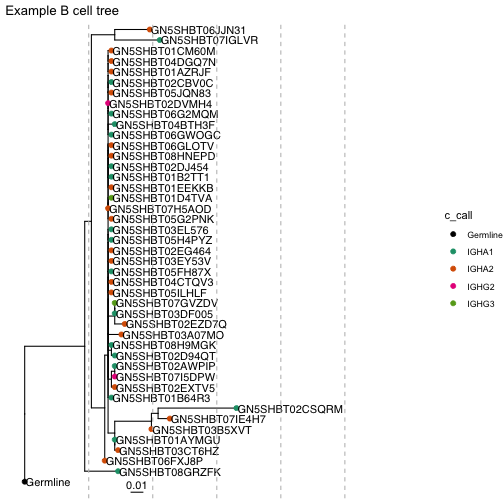
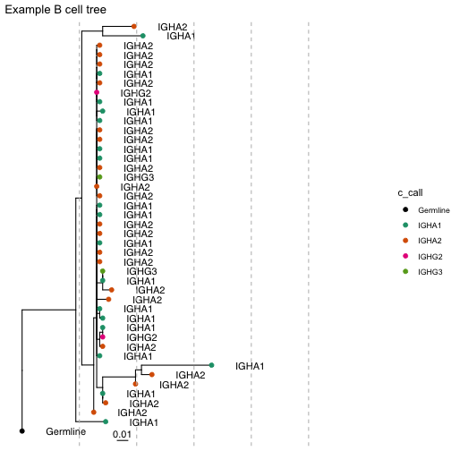
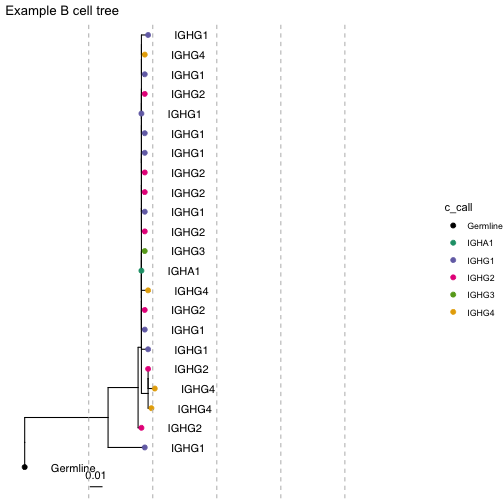

# Plotting Lineage Trees

Once trees have been built, they can be visualized in multiple ways. The easiest is through the `ggtree` R package. Dowser implements the `plotTrees` function, which makes plotting multiple trees using `ggtree` easier.

First, you have to build the trees. See the previous vignette for examples.

## Basic plotting

Once trees are built, the `plotTrees` function will return a list of tree plots in the same order as in the input tibble.


```r
library(dowser)

data(ExampleClones)

ExampleClones = ExampleClones[1:2,]

plots = plotTrees(ExampleClones)

#Plot the largest tree
#To plot second largest tree, use plots[[2]], and so on
plots[[1]]
```



Default options for `plotTrees` will only plot tree topology and branch lengths. The `clone_id` is by default plotted on the upper lefthand corner. Branch lengths by default represent the number of mutations per site between each node in the tree. These are shown by the scalebar below the tree.

To plot the expected number of mutations between nodes (calculated by multiplying the branch length by the number of sites), use the `scaleBranches` function. The width of the scalebar can be set with the `scale` option. 


```r
# Re-scale branches to represent mutations between nodes
ExampleClones_m = scaleBranches(ExampleClones, edge_type="mutations")

# Plot, set scale bar to represent 10 mutations
plots = plotTrees(ExampleClones_m, scale=10)

#Plot the largest tree
plots[[1]]
```



## Plotting metadata

Metadata associated with each tip in the tree can be plotted by specifying the `tips` and `tipsize` options in the `plotTrees` function. Note however, that you can only specify metadata fields that are specified in the `formatClones` function using either the `traits`, `text_fields`, `num_fields`, or `seq_fields` options.


```r
# Plot tree with sequence isotype at the tips.
plots = plotTrees(ExampleClones, tips="c_call")

#Plot the largest tree
plots[[1]]
```



Tip sizes can be manually set to a constant value e.g. `tipsize=2` or set to a data column. For instance, we can scale the tip sizes by the duplicate count of each sequence:


```r
# Plot tree with sequence isotype at the tips, with sizes set to number of duplicates
plots = plotTrees(ExampleClones, tips="c_call", tipsize="duplicate_count")

#Plot the largest tree
plots[[1]]
```



The `tip_palette` is constant among all trees plotted at once, and can be specified as either a named vector of hex colors, or as an RColorBrewer palette name:


```r
# These calls create the same plot:

# Plot tree with sequence isotype at the tips, with palette "Set1"
plots = plotTrees(ExampleClones, tips="c_call", tipsize=2,
    tip_palette="Paired")

# or, specify a named palette vector
custom_palette=c(
    "IGHM"    ="#a6cee3",
    "IGHD"    ="#1f78b4",
    "IGHG3"   ="#b2df8a",
    "IGHG1"   ="#33a02c",
    "IGHA1"   ="#fb9a99",
    "IGHG2"   ="#e31a1c",
    "IGHG4"   ="#fdbf6f",
    "IGHE"    ="#ff7f00",
    "IGHA2"   ="#cab2d6",
    "Germline"="#6a3d9a")

plots = plotTrees(ExampleClones, tips="c_call", tipsize=2,
    palette=custom_palette)

# or, use the getPalette function to create a named palette vector
custom_palette = getPalette(c("IGHM","IGHD","IGHG3","IGHG1","IGHA1",
    "IGHG2","IGHG4","IGHE","IGHA2"), "Paired")

plots = plotTrees(ExampleClones, tips="c_call", tipsize=2,
    palette=custom_palette)

#Plot the largest tree
plots[[1]]
```



## Using ggtree and ggplot functions

The objects returned by `plotTrees` are`ggtree` and `ggplot` objects, and can be manipulated as such. For instance, we can add tip labels using the `geom_tiplab` function (the sequence_id column is the default) from `ggtree`, add vertical lines using the `geom_vline` function from `ggplot`, and edit the title using `ggtitle`. `xlim` can be used to add enough space to the plot for the sequence IDs.


```r
library(ggtree)

plots = plotTrees(ExampleClones, tips="c_call", tipsize=2)

#Plot the largest tree
treeplot = plots[[1]] + geom_tiplab() + 
    geom_vline(xintercept=c(0.05,0.1,0.15,0.2,0.25),
        linetype="dashed",color="grey") + xlim(0,0.3) +
    ggtitle("Example B cell tree")

treeplot
```


To change what is displayed on the tips with the `geom_tiplab` function, change the mapping. Additionally, the distance from the text from `geom_tiplab` can be spaced differently using the `offset` argument. 


```r
library(ggtree)

plots = plotTrees(ExampleClones, tips="c_call", tipsize=2)

#Plot the largest tree
treeplot = plots[[1]] + geom_tiplab(aes(label=c_call), offset = 0.02) + 
    geom_vline(xintercept=c(0.05,0.1,0.15,0.2,0.25),
        linetype="dashed",color="grey") + xlim(0,0.3) +
    ggtitle("Example B cell tree")

treeplot
```


To make changes to all trees at once, use lapply


```r
library(ggtree)

plots = plotTrees(ExampleClones, tips="c_call", tipsize=2)

#Manually adjust all trees
treeplots = lapply(plots, function(x)
  x + geom_tiplab(aes(label=c_call), offset = 0.02) + 
    geom_vline(xintercept=c(0.05,0.1,0.15,0.2,0.25),
        linetype="dashed",color="grey") + xlim(0,0.3) +
    ggtitle("Example B cell tree")
  )

# plot 1st and 2nd largest trees
treeplots[[1]]
treeplots[[2]]
```

<div class="figure">

<p class="caption">plot of chunk Plotting-Trees-Vignette-8</p>
</div>

## Saving trees to a file

The `treesToPDF` function can be used to plot all trees at once to a pdf file:


```r
plots = plotTrees(ExampleClones, tips="c_call", tipsize=2)

# you can also pass arguments you would pass to grDevices::pdf, like width and height
# here, we plot 4 trees per page (2 rows, 2 columns)
treesToPDF(plots, file="trees.pdf", nrow=2, ncol=2)
```

