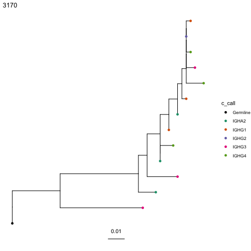

# Quickstart

Quick start of lineage tree reconstruction.


``` r
# Load required packages
library(alakazam)
```

```
## Error in `FUN()`:
## ! cannot open file '/Library/Frameworks/R.framework/Versions/4.5-arm64/Resources/library/dowser/data/Rdata.rdb': No such file or directory
```

``` r
library(dowser)

# load example AIRR tsv data
data(ExampleAirr)

# subset data for this example
ExampleAirr = ExampleAirr[ExampleAirr$clone_id %in% c("3170", "3184"),]

# Process example data into proper format, store isotype (optional)
clones = formatClones(ExampleAirr, traits="c_call")
```

```
## Error in `stopCodonCheck()`:
## ! No sequences provided
```

``` r
# Build maxmimum parsimony trees for first two clones using 
# phangorn package in R
trees <- getTrees(clones)

# simple tree plotting with ggtree R package with isotypes at tips
plots <- plotTrees(trees, tips="c_call",tipsize=2)
```

```
## Error in `plotTrees()`:
## ! cannot open file '/Library/Frameworks/R.framework/Versions/4.5-arm64/Resources/library/dowser/R/dowser.rdb': No such file or directory
```

``` r
# plot tree of largest clone
plots[[1]]
```



