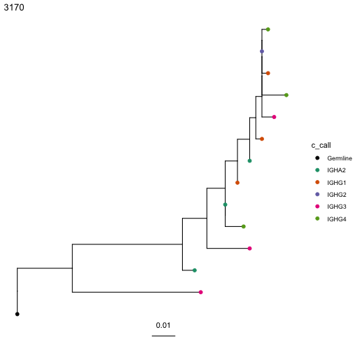

# Quickstart

Quick start of lineage tree reconstruction.


```r
# Load required packages
library(alakazam)
library(dowser)

# load example AIRR tsv data
data(ExampleDb)

ExampleDb = ExampleDb[ExampleDb$clone_id %in% c("3170", "3184"),]

# Process example data into proper format, store isotype (optional)
clones = formatClones(ExampleDb, trait="c_call")

# Build maxmimum parsimony trees for first two clones using 
# phangorn package in R
trees <- getTrees(clones)

# simple tree plotting with ggtree R package with isotypes at tips
plots <- plotTrees(trees, tips="c_call")

# plot tree of largest clone
plots[[1]]
```


