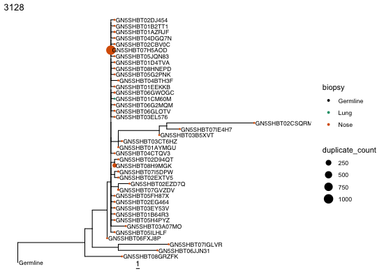
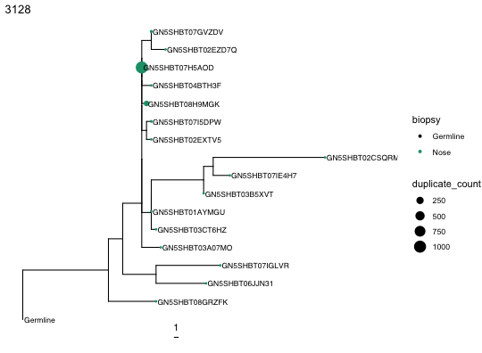

# Removing problematic sequences

Repertoire sequencing data often contains sequences that shouldn't go into a lineage tree analysis: partial or poorly-covered reads, and low-count sequences that are really just oversequencing or PCR error rather than genuine clonal members. Dowser provides two functions for cleaning these out of an AIRR/Change-O data set before clones are formatted and trees are built: `filterPartialSeqs` and `filterCombs`.

## Removing partial sequences

Partial or truncated sequences (e.g. reads only covering part of the V region) can distort alignments and clonal clustering. `filterPartialSeqs` removes any sequence whose alignment doesn't contain enough real nucleotide calls, and is **highly recommended before clonal clustering**, not just before tree building.

For each sequence, it counts characters matching `pattern` (default `[ATCG]`, i.e. unambiguous nucleotides) and drops any sequence with fewer matches than `cutoff` (default 250).

The example data has no partial sequences, so we'll simulate one by masking the second half of a sequence's alignment with `N`s, as if only the first half had been sequenced.


``` r
library(dowser)
library(dplyr)
library(ggtree)

data(ExampleAirr)

# Simulate a partial/truncated sequence
row <- which(ExampleAirr$sequence_id == "GN5SHBT04BIIPE")
orig <- ExampleAirr$sequence_alignment[row]
ExampleAirr$sequence_alignment[row] <- paste0(
  paste(rep(".", 150), collapse=""), substr(orig, 150, nchar(orig)))

# example partial/truncated sequence that could mess up clonal clustering
print(ExampleAirr$sequence_alignment[row])
```

```
## [1] "......................................................................................................................................................GGAGTGGGTAGGCTTCATTAGAAGCAAACTTTTTGGTGGGACAGCAGACTACGCCGCGTCAGTGGAA...GGCAGATTCACCATCTCAAGAGAAGATTCCGAGAGCACCGCCTATCTGCAAATGGATAGCCTGAAGACCGAGGACACAGGCTTTTATTATTGTAGTAGAGATCTCCGGGTTAGTTCCACAGCAGCTGGCACTAACTGGTTCGACCCCCGGGGCCAGGGAGCCCTGGTCACCGTCTCCTCAG"
```


``` r
filtered <- filterPartialSeqs(ExampleAirr)
```

```
## [1] "1 partial sequences removed"
```

`GN5SHBT04BIIPE` is removed, since it no longer passes the default `cutoff=250`.


``` r
"GN5SHBT04BIIPE" %in% filtered$sequence_id
```

```
## [1] FALSE
```

For non-standard alignment columns or a different cutoff, adjust `seq`, `cutoff`, and `pattern`.

## Removing "comb" artifacts

Bulk BCR sequencing, especially without UMIs, often generates near-identical sequences that differ from a much more abundant sequence by only one or two nucleotides. This is often thought to result from oversequencing or PCR error, not real somatic hypermutation. In a lineage tree this shows up as a "comb": a flat polytomy of low-`duplicate_count` tips radiating from a single node with a much higher `duplicate_count`. `filterCombs` detects and removes these likely comb artifacts. 

To work, the `clone_id` must already be already assigned, so `filterCombs` should run after clonal clustering but still before `formatClones`.

For each sequence with a `duplicate_count` at or above `dup_count_thresh`, it compares against every other sequence in the same clone, cutting a candidate if its duplicate count is low relative to the higher-count sequence, scaled by their Hamming distance:

```
child[[`duplicate`]]/parent[[`duplicate`]] < 10^(-(`exponent` + Hamming distance[child, parent]))
```

More distant sequences are allowed a higher relative duplicate count before being cut. Near-identical ones are held to a much stricter ratio. This ratio decreases by 10-fold with each additional sequence difference from the parent sequence.

### Simulating a comb artifact


``` r
data(ExampleAirr)

# Simulate an oversequencing/PCR error artifact within clone 3128
ExampleAirr$duplicate_count[ExampleAirr$sequence_id == "GN5SHBT07H5AOD"] = 1000
ExampleAirr$duplicate_count[ExampleAirr$sequence_id == "GN5SHBT08H9MGK"] = 101
```

Build a tree for clone 3128 as usual, scaling tip size by `duplicate_count`.


``` r
clone <- filter(ExampleAirr, clone_id == 3128)
clones <- formatClones(clone, trait="biopsy", num_fields="duplicate_count")
trees <- scaleBranches(getTrees(clones))

plotTrees(trees, tipsize="duplicate_count", tips="biopsy", scale=1)[[1]] +
  geom_tiplab(size=3) + xlim(0, 75)
```



Notice the flat radiation of `duplicate_count` ~1 tips branching directly from `GN5SHBT07H5AOD` (`duplicate_count` 1000). These many near-identical, low-count sequences radiating from one much higher-count sequence is the signature of a comb, which is often suspected to be from PCR or sequencing error.

### Removing comb artifacts

Run `filterCombs` on the full, unfiltered data set, using the defaults `dup_count_thresh=100` and `exponent=1`.


``` r
filtered <- filterCombs(ExampleAirr, dup_count_thresh=100, exponent=1)
```

```
## [1] "Removed 25 sequences from data."
```

Rebuild the tree for clone 3128 from the filtered data.


``` r
fclone <- filter(filtered, clone_id == 3128)
fclones <- formatClones(fclone, trait="biopsy", num_fields="duplicate_count")
ftrees <- scaleBranches(getTrees(fclones))

plotTrees(ftrees, tipsize="duplicate_count", tips="biopsy", scale=1)[[1]] +
  geom_tiplab(size=3) + xlim(0, 75)
```



Most of the comb tips around `GN5SHBT07H5AOD` and `GN5SHBT08H9MGK` are gone.

### Choosing parameters

* `dup_count_thresh`: minimum `duplicate_count` for a sequence to be treated as a potential comb source. Raising it makes filtering more conservative.
* `exponent`: how aggressively nearby sequences are cut. At `exponent=1`, a child needs a duplicate count ratio below 1/100 of its neighbor's to be cut at Hamming distance 1 (1/1000 at distance 2). `exponent=2` is less strict, requiring 1/1000 at distance 1, removing fewer sequences.
* `gap`: gap penalty for the Hamming distance calculation. `gap=0` (default) ignores gaps.
* `id`, `seq`, `clone`, `duplicate`: column names, and by default are set to the standard AIRR format.

## Recommended order

Putting this all together, a typical pipeline might look like:

1. `filterPartialSeqs` on the raw AIRR/Change-O data, before clonal clustering.
2. Clonal clustering (for example with [SCOPer](https://scoper.readthedocs.io)), which assigns `clone_id`.
3. `filterCombs` on the clustered data, before `formatClones`.
4. `createGermlines`, `formatClones`, and tree building as usual.
