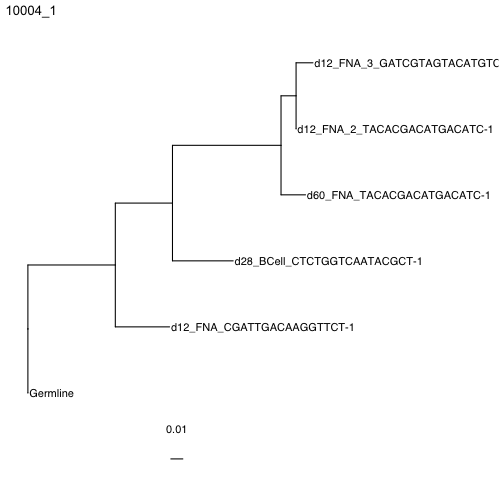

# Building trees with paired heavy and light chain data

With the advances in sequencing, single cell datasets can now pair heavy and light chain sequences from the same B cell. However, B cells clones defined by heavy chains can have cells with distinct light chain rearrangements that don't descend from the same light chain VJ rearrangement. This can cause issues with multiple sequence alignments that include light chains. Dowser can identify these different light chain VJ rearrangements within a clone, assigning each discint light chain VJ rearrangement subgroup a numerical value called a clone_subgroup. More specifically, subgroups are defined by light chain V gene, J gene, and junction length. This step must be done before formatting clones and building trees. 

## Resolve light chains 

To resolve the light chains within a clone, use the `resolveLightChains` function. This function will:

1. Pair heavy and light chains together by their cell_id and using the light chain VJ rearrangement, identify different rearrangements within a clone. Each cell will be assigned `clone_subgroup` based on which light chain subgroup it is assiged to. 
2. Assign heavy chains without an associated light chain to the subgroup containing the most similar paired heavy chain.
3. Remove light chains without paired heavy chains.

The output of this function is a tibble in which each row is a different sequence, with all of the previously included data along with a few more columns. Two columns are added: `clone_subgroup` contains the subgroup within the heavy chain-defined clone, with 1 being the largest subgroup within a clone. `clone_subgroup_id` contains the `clone_id` + the `clone_subgroup`.


```r
library(dowser)
library(ggtree)
# load example tsv data
data("ExampleMixedDb")

# find the clone subgroups 
ExampleMixedDb <- resolveLightChains(ExampleMixedDb)
print(ExampleMixedDb$clone_subgroup)
```

## Reconstruct germlines

Next, it is important to reconstruct the clonal germline sequences for each subgroup. In this step it is important to specify `clone = clone_subgroup_id` so that a separate germline is constructed for each light chain subgroup.


```r
# run createGermlines -- this will create new germline for each locus in each subgroup 
# the directory for the references matches the location on docker
references <- readIMGT("/usr/local/share/germlines/imgt/human/vdj")
ExampleMixedDb <- createGermlines(ExampleMixedDb, references = references, clone = "clone_subgroup_id", nproc = 1)
```

## Format clones

The next step is to convert the data into airrClone objects that can be used for tree building. As with heavy chain sequences, this is done using the `formatClones` function. To build trees with paired heavy and light chains, specify `chain = "HL"`. This will concatenate the paired heavy and light chains into a single sequence alignment. To only use the heavy chain, simply leave `chain = "H"`, the default. For more information on formatClones see the [Building Trees Vignette](Building-Trees-Vignette.md).


```r
clones <- formatClones(ExampleMixedDb, chain="HL", nproc=1, collapse = FALSE, 
                       split_light = TRUE, minseq = 3)
print(clones)
```
## Building trees 

Trees can be built from paired heavy and light chains with any of the methods that Dowser supports. Methods are divided into three broad categories: maximum parsimony, maximum likelihood, and partitioned maximum likelihood. IgPhyML v2.0.0 and RAxML can use maximum likelihood models with multiple partitions. Both of these methods support "scaled" branch lengths models. These models group information from paired heavy and light chain data separately into different groups called partitions, and allows the branch lengths of heavy and light chain partitions to differ by a scalar factor estimated by maximum likelihood. This creates more accurate branch length estimates, particularly when some light chains are missing. Branch lengths then represent the number of mutations per site along both heavy and light chains. To use these models in IgPhyML, specify `partition = "hl"` as below.

For details on each of the different methods, including the specifics about different partition models, see the [Building Trees Vignette](Building-Trees-Vignette.md).


```r
# Building maximum likelihood trees with multiple partitions using IgPhyML 
# Only the newest version of IgPhyML supports this option
# exec here is set to IgPhyML position in the Docker image.
clones <- getTrees(clones, build="igphyml", nproc=1, partition="hl",
                   exec="/usr/local/share/igphyml/src/igphyml")
```


```r
plotTrees(clones)[[1]]+geom_tiplab()+xlim(0,0.35)
```




Building maximum likelihood trees with multiple partitions using *RAxML* instead, which is similar to `partition = "hl"` in IgPhyML. 


```r
# exec is set to RAxML position in the Docker image.
clones = getTrees(clones, build="raxml", 
    exec="/usr/local/bin/raxml-ng", nproc=1, partition="scaled")
```


```r
plotTrees(clones)[[1]]+geom_tiplab()+xlim(0, 0.12)
```


