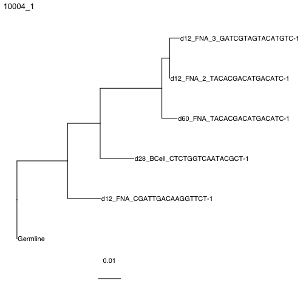

# Building trees with paired heavy and light chain data

With the advances in sequencing, single cell datasets can now pair heavy and light chain sequences. However, b cells clones can have cells with distinct light chain rearrangements that don't descend for the same light chain VJ rearrangement, causing ambiguities in the light chain sequences. Dowser can identify these different light chain VJ rearrangements within a clone, assigning each different light chain VJ rearrangement a numerical value called a clone_subgroup. This resolves the ambiguities. This step is done before formatting clones and building trees and allows for accurate phylogenetic construction of BCRs with paired heavy and light chain data. 

## Resolve light chains 

To resolve the light chains within a clone, use the resolveLightChains function. This function will:

1. Pair heavy and light chains together by their cell_id and using the light chain VJ rearrangement, identify different rearrangements within a clone. Following, each heavy and light chain pairing will be assigned `clone_subgroup` based on the different light chain VJ rearrangements within a clone. 
2. Assign heavy chains without an associated light chain to the subgroup containing the most similar paired heavy chain.

The output of this function is a tibble in which each row is a different sequence, with all of the previously included data along with a few more columns. The column `clone_subgroup` contains the subgroup assignment for that sequence within a given clone, with 1 being the largest.  


```r
library(dowser)
library(ggtree)
# load example tsv data
data("ExampleMixedDb")

# find the clone subgroups 
ExampleMixedDb <- resolveLightChains(ExampleMixedDb)
print(ExampleMixedDb$clone_subgroup)
# [1] 2 1 1 1 1 1 1 1 1 1 1 2 1 1 1 1 1 1 1 1 1 1 1 1 1 1 1 1 1 1 1 1
```


```r
# run createGermlines -- this will create new germline for each locus in each subgroup 
# the directory for the references matches the location on docker
references <- readIMGT("/usr/local/share/germlines/imgt/human/vdj")
ExampleMixedDb <- createGermlines(ExampleMixedDb, clone = "clone_subgroup_id", nproc = 1)
```

## Format clones

The next step is to convert the data into airrClone objects that can be used for tree building. As with heavy chain sequences, this is done using the formatClones function. To build trees with paired heavy and light chains, specify `chain` = "HL". This will concatenate the paired heavy and light chains into a single sequence alignment. To only use the heavy chain, simply leave chain = "H", the default. For more information on formatClones see the [Building Trees Vignette](Building-Trees-Vignette.md).


```r
clones <- formatClones(ExampleMixedDb, chain="HL", nproc=1, collapse = FALSE, 
                       split_light = TRUE)
print(clones)
## A tibble: 4 x 4
#   clone_id data       locus    seqs
#   <chr>    <list>     <chr>   <int>
# 10004_1  <airrClon> IGH,IGK     5
# 8232_1   <airrClon> IGH,IGL     4
# 43426_1  <airrClon> IGH,IGL     3
# 60925_1  <airrClon> IGH,IGL     3
```
## Building trees 

Trees can now be built with any of the methods that dowser supports. Methods are divided into three broad categories: maximum parsimony, maximum likelihood, and partitioned maximum likelihood. IgphyML and RAxML can use partitioned maximum likelihood models. Both of these methods support "scaled" branch lengths models. These models group information from paired heavy and light chain data separately into different groups called partitions. This allows different partitions to differ by a scalar factor estimated by maximum likelihood. This creates the most accurate branch length reconstructions, where branch lengths represent the number of mutations per site along both heavy and light chains.

For details on each of the different methods, including the specifics about different partition models, see the [Building Trees Vignette](Building-Trees-Vignette.md).


```r
# Building maximum likelihood trees with multiple partitions using IgPhyML where partitions 
# seperate by heavy chain information and ligth chain information
# exec here is set to IgPhyML position in the Docker image.
clones <- getTrees(clones, build="igphyml", nproc=1, partition="hl",
                   exec="/usr/local/share/igphyml/src/igphyml")
```


```r
plotTrees(clones)[[1]]+geom_tiplab()
```


```r
library(dowser)
library(ggtree)
# Load data instead of running phylip
data(ExampleMixedClones)
ExampleMixedClones$trees <- ExampleMixedClones$igphyml_partitioned_trees
plotTrees(ExampleMixedClones)[[1]]+geom_tiplab()
```


Building maximum likelihood trees with multiple partitions using *RAxML* instead, which is similar to partition = "hl" in IgPhyML. RAxML does not estimate omega values, so this parameter is not necessary. 

```r
# exec here is set to RAxML position in the Docker image.
clones = getTrees(clones, build="raxml", 
    exec="/usr/local/bin/raxml-ng", nproc=1, partition="scaled")
```


```r
plotTrees(clones)[[1]]+geom_tiplab()
```


```r
data(ExampleMixedClones)
# change the tree names
ExampleMixedClones$trees <- ExampleMixedClones$raxml_partitioned_trees
plotTrees(ExampleMixedClones)[[1]]+geom_tiplab()
```


