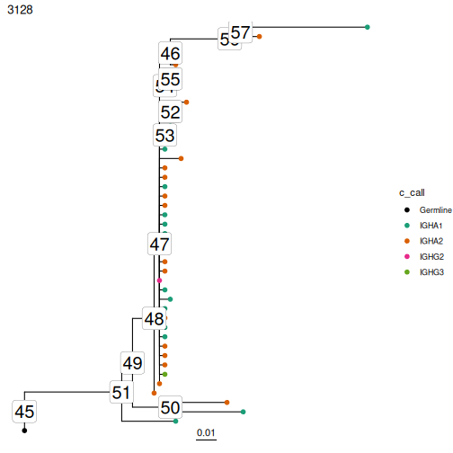

# Reconstruct Intermediate Sequences

Dowser automatically reconstructs intermediate sequences as part of the `getTrees` function. These are stored in the `nodes` list contained in each `phylo` object.

First, collapse internal nodes with identical sequences using the `collapesNodes`. This will significantly clean up the visualization. You could alternatively run `getTrees` with `collapse=TRUE`. Then, visualize the trees using `plotTrees` but with the `node_nums` parameter set. This will display the ID number of each internal node.

To obtain the IMGT-gapped sequence for each reconstructed node, specify the clone ID and node number in the `getNodeSeq` function.


```r
library(dowser)

data(ExampleClones)

# Collapse nodes with identical sequences. This will 
trees = collapseNodes(ExampleClones[1:2,])

# Plot trees with node ID numbers
plots = plotTrees(trees, tips="c_call", tipsize=2, node_nums=TRUE, labelsize=7)

plots[[1]]
```



```r
sequence = getNodeSeq(trees, node=50, clone=3128)
```

```
## Error in getNodeSeq(trees, node = 50, clone = 3128): could not find function "getNodeSeq"
```

```r
print(sequence)
```

```
## function (nvec, ...) 
## UseMethod("sequence")
## <bytecode: 0x5609f0acdbc0>
## <environment: namespace:base>
```
