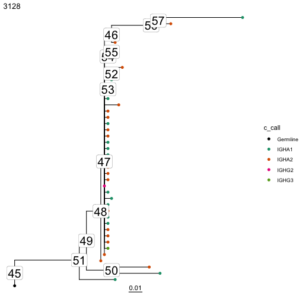

# Reconstruct Intermediate Sequences

Dowser automatically reconstructs intermediate sequences as part of the `getTrees` function. These are stored in the `nodes` list contained in each `phylo` object.

First, collapse internal nodes with identical sequences using the `collapesNodes`. This will significantly clean up the visualization. You could alternatively run `getTrees` with `collapse=TRUE`. Then, visualize the trees using `plotTrees` but with the `node_nums` parameter set. This will display the ID number of each internal node.

To obtain the IMGT-gapped sequence for each reconstructed node, specify the clone ID and node number in the `getNodeSeq` function.

To obtain all observed and reconstructed sequences for all clones, use the `getAllSeqs` function.

You can  save the output of `getAllSeqs` as a fasta file using the `dfToFasta` function.


``` r
library(dowser)

data(ExampleClones)

# Collapse nodes with identical sequences. This will 
trees = collapseNodes(ExampleClones[1:2,])
```

```
## Error:
## ! cannot open file '/Library/Frameworks/R.framework/Versions/4.5-arm64/Resources/library/dowser/R/dowser.rdb': No such file or directory
```

``` r
# Plot trees with node ID numbers
plots = plotTrees(trees, tips="c_call", tipsize=2, node_nums=TRUE, labelsize=7)
```

```
## Error in `plotTrees()`:
## ! cannot open file '/Library/Frameworks/R.framework/Versions/4.5-arm64/Resources/library/dowser/R/dowser.rdb': No such file or directory
```

``` r
plots[[1]]
```



``` r
sequence = getNodeSeq(trees, node=50, clone=3128)
```

```
## Error:
## ! cannot open file '/Library/Frameworks/R.framework/Versions/4.5-arm64/Resources/library/dowser/R/dowser.rdb': No such file or directory
```

``` r
print(sequence)
```

```
## function (nvec, ...) 
## UseMethod("sequence")
## <bytecode: 0x15d98acc0>
## <environment: namespace:base>
```

``` r
# Get all sequences as a data frame
all_sequences = getAllSeqs(trees)
```

```
## Error:
## ! cannot open file '/Library/Frameworks/R.framework/Versions/4.5-arm64/Resources/library/dowser/R/dowser.rdb': No such file or directory
```

``` r
head(all_sequences)
```

```
## Error:
## ! object 'all_sequences' not found
```

## Saving sequences to a file

The `dfToFasta` function can be used to save a dataframe of sequences as a fasta file:


``` r
# Save all sequences as a fasta file
dfToFasta(all_sequences, file="all_sequences.fasta", id="node_id", columns=c("clone_id","locus"))
```
