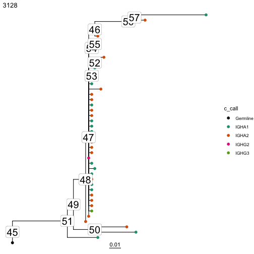

# Reconstruct Intermediate Sequences

Dowser automatically reconstructs intermediate sequences as part of the `getTrees` function. These are stored in the `nodes` list contained in each `phylo` object.

First, collapse internal nodes with identical sequences using the `collapesNodes`. This will significantly clean up the visualization. You could alternatively run `getTrees` with `collapse=TRUE`. Then, visualize the trees using `plotTrees` but with the `node_nums` parameter set. This will display the ID number of each internal node.

To obtain the IMGT-gapped sequence for each reconstructed node, specify the clone ID and node number in the `getNodeSeq` function.

To obtain all observed and reconstructed sequences for all clones, use the `getAllSeqs` function.

You can  save the output of `getAllSeqs` as a fasta file using the `dfToFasta` function.


``` r
library(dowser)

data(ExampleClones)

# Collapse nodes with identical sequences. This will 
trees = collapseNodes(ExampleClones[1:2,])

# Plot trees with node ID numbers
plots = plotTrees(trees, tips="c_call", tipsize=2, node_nums=TRUE, labelsize=7)

plots[[1]]
```



``` r
sequence = getNodeSeq(trees, node=50, clone=3128)

print(sequence)
```

```
##                                                                                                                                                                                                                                                                                                                                                                                                                    N 
## "GAGGTGCAGCTGGTGGAGTCTGGGGGA...GGCTTGGTVCAGCCTGGGGGGTCCCTGAGACTCTCCTGTGCAGCCTCTGGATTCACCTTC............AGTGAYTATGCCATGAGCTGGTTCCGCCAGGCTCCAGGGAAGGGKCTGGAGTGGGTGGGTTTCATTAGAAGCAGACGTTTTGGTGGGACGCCGGACTACGCCGCGTCAGTGAGA...GACAGATTCACCATTTCAAGAGACGATTCCAAAAGCATCGCCTATCTGCAAATGAACAGCCTGAAAACCGAGGACACAGCCGTGTATTTTTGTAGTAGAGATCTCGCGGTTATATCCACAATAGCTGGTACTAACTGGTTCGACCCCAGGGGCCAGGGAGCCCTGGTCACCGTCTCCTCAGNN"
```

``` r
# Get all sequences as a data frame
all_sequences = getAllSeqs(trees)

head(all_sequences)
```

```
## # A tibble: 6 × 6
##   clone_id node_id         node locus sequence                                                                       sequence_alignment
##      <dbl> <chr>          <int> <chr> <chr>                                                                          <chr>             
## 1     3128 GN5SHBT02CBV0C     1 N     GAGGTGCAGCTGGTGGAGTCCGGGGGAGGCTTGGTACAGCCAGGGCGGTCTCTGAGACTCTCCTGTACAGCTTCTGG… GAGGTGCAGCTGGTGGA…
## 2     3128 GN5SHBT01B64R3     2 N     GAGGTGCAGCTGGTGGAGTCCGGGGGAGGCTTGGTACAGCCAGGGCGGTCTCTGAGACTCTCCTGTACAGCTTCTGG… GAGGTGCAGCTGGTGGA…
## 3     3128 GN5SHBT02EXTV5     3 N     GAGGTGCAGCTGGTGGAGTCCGGGGGGGCCTTGGTACAGCCAGGGCGGTCTCTGAGACTCTCCTGTACAGCTTCTGG… GAGGTGCAGCTGGTGGA…
## 4     3128 GN5SHBT08H9MGK     4 N     GAGGTGCAGCTGGTGGAGTCGGGGGGAGGCTTGGTACAGCCAGGGCGGTCTCTGAGACTCTCCTGTACAGCTTCTGG… GAGGTGCAGCTGGTGGA…
## 5     3128 GN5SHBT06FXJ8P     5 N     GAGGTGCAGCTGGTGGAGTCTGGGGGAGGCTTGGTACAGCCAGGGCGGTCTCTGAGACTCTCCTGTACAGCTTCTGG… GAGGTGCAGCTGGTGGA…
## 6     3128 GN5SHBT03CT6HZ     6 N     GAGGTGCAGCTGGTGGAGTCCGGGGGAGGCTTGGTACAGCCAGGGCGGTCTCTGAGACTCTCCTGTACAGCTTCTGG… GAGGTGCAGCTGGTGGA…
```

## Saving sequences to a file

The `dfToFasta` function can be used to save a dataframe of sequences as a fasta file:


``` r
# Save all sequences as a fasta file
dfToFasta(all_sequences, file="all_sequences.fasta", id="node_id", columns=c("clone_id","locus"))
```
